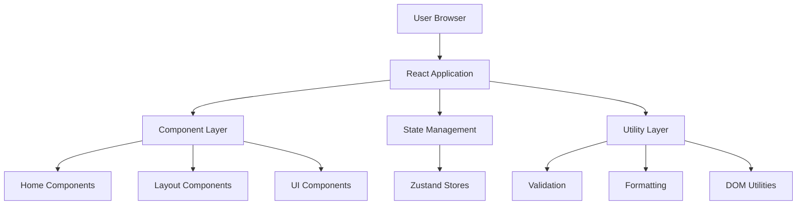
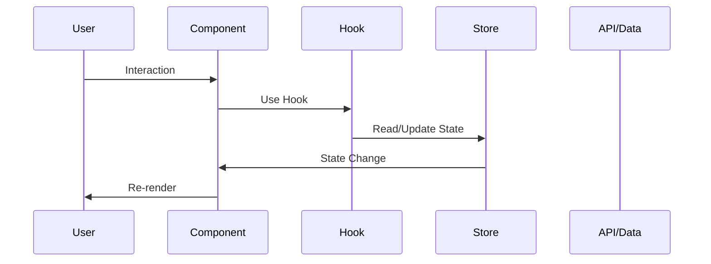
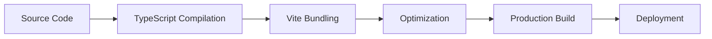

# Architecture Overview - Lyne Digital Studio

## 📐 System Architecture

### High-Level Overview



---

## 🏗️ Application Layers

### 1. Presentation Layer (Components)

**Location**: `src/components/`

#### Home Components
- **Hero**: Landing section with image and animations
- **Services**: Service showcase with hover effects
- **Portfolio**: 3D carousel for project display
- **Clients**: Client logo marquee
- **FAQ**: Accordion component
- **Pricing**: Pricing packages and custom quotes

#### Layout Components
- **Navbar**: Navigation with mobile menu
- **Footer**: Contact form and footer content

#### UI Components
- **Reveal**: Scroll-triggered animations
- **AnimatedCounter**: Number animation component
- **Preloader**: Loading screen
- **CustomCursor**: Custom cursor for desktop

### 2. State Management Layer

**Location**: `src/store/`

**Technology**: Zustand

```typescript
// Example: UI Store
interface UIStore {
    heroImageLoaded: boolean;
    setHeroImageLoaded: (loaded: boolean) => void;
}
```

**Stores**:
- `useUIStore` - UI state (loading, modals, etc.)

### 3. Business Logic Layer

**Location**: `src/hooks/`, `src/utils/`

#### Custom Hooks
- `useScrollPosition` - Track scroll position
- `useWindowSize` - Track window dimensions
- `useIntersectionObserver` - Visibility detection

#### Utilities
- **Validation**: Form validation functions
- **Format**: Number, date, text formatting
- **DOM**: DOM manipulation helpers
- **Helpers**: General utility functions

### 4. Data Layer

**Location**: `src/components/home/portfolioData.ts`

Static data for projects, services, clients, etc.

---

## 🔄 Data Flow

### Component Rendering Flow



### Example: Hero Component

1. **Mount**: Component renders with loading state
2. **Image Load**: Hero image loads
3. **State Update**: `setHeroImageLoaded(true)` called
4. **Store Update**: Zustand store updates
5. **Re-render**: Component shows content
6. **Animation**: Reveal animations trigger

---

## 📦 Module Dependencies

### Dependency Graph

```
App
├── Layout
│   ├── Navbar
│   │   └── useScrollPosition
│   └── Footer
│       └── useIntersectionObserver
├── Home
│   ├── Hero
│   │   ├── Reveal
│   │   └── useUIStore
│   ├── Services
│   │   └── Reveal
│   ├── Portfolio
│   │   ├── PortfolioCard
│   │   ├── PortfolioModal
│   │   └── useIntersectionObserver
│   ├── Clients
│   │   └── Reveal
│   ├── FAQ
│   │   └── Reveal
│   └── Pricing
│       └── Reveal
└── UI Components
    ├── Preloader
    │   └── useUIStore
    ├── CustomCursor
    └── AnimatedCounter
```

---

## 🎨 Styling Architecture

### Tailwind CSS Configuration

**Location**: `tailwind.config.js`

**Custom Theme**:
```javascript
{
    colors: {
        brand: {
            black: '#0A0A0A',
            red: '#FF2E00',
            accent: '#FF6B4A'
        }
    },
    fontFamily: {
        display: ['Outfit', 'sans-serif'],
        mono: ['JetBrains Mono', 'monospace']
    }
}
```

### CSS Organization

1. **Global Styles**: `src/index.css`
2. **Component Styles**: Tailwind utilities
3. **Animations**: Framer Motion + Tailwind

---

## 🧪 Testing Architecture

### Test Structure

```
src/
├── components/
│   └── __tests__/
├── hooks/
│   └── __tests__/
├── utils/
│   └── __tests__/
└── test/
    ├── setup.ts      # Global setup
    └── utils.tsx     # Test utilities
```

### Testing Layers

1. **Unit Tests**: Utilities, hooks
2. **Component Tests**: UI components
3. **Integration Tests**: User flows (future)

### Coverage Goals

- **Utilities**: 95%+
- **Hooks**: 90%+
- **Components**: 90%+
- **Overall**: 75-80%

---

## 🚀 Build & Deployment

### Build Process



### Build Commands

```bash
# Development
npm run dev

# Production build
npm run build

# Preview production
npm run preview
```

### Output Structure

```
dist/
├── assets/
│   ├── index-[hash].js
│   ├── index-[hash].css
│   └── images/
└── index.html
```

---

## 🔧 Configuration Files

### Key Configurations

| File | Purpose |
|------|---------|
| `vite.config.ts` | Vite bundler config |
| `vitest.config.ts` | Test runner config |
| `tsconfig.json` | TypeScript config |
| `tailwind.config.js` | Tailwind CSS config |
| `package.json` | Dependencies & scripts |

---

## 🌐 Routing

**Technology**: React Router v6

**Routes**:
- `/` - Home page
- `/consultation` - Consultation form

**Navigation**: Hash-based scrolling for sections

---

## 📱 Responsive Design

### Breakpoints

```javascript
{
    sm: '640px',   // Mobile landscape
    md: '768px',   // Tablet
    lg: '1024px',  // Desktop
    xl: '1280px',  // Large desktop
    '2xl': '1536px' // Extra large
}
```

### Mobile-First Approach

```tsx
// Mobile default, desktop override
<div className="text-sm md:text-base lg:text-lg">
    Content
</div>
```

---

## ⚡ Performance Optimizations

### Code Splitting

- Route-based splitting
- Component lazy loading
- Dynamic imports

### Image Optimization

- WebP format
- Lazy loading
- Responsive images
- Priority loading for hero

### Animation Performance

- `will-change` CSS property
- GPU acceleration
- RequestAnimationFrame
- Intersection Observer

---

## 🔐 Security Considerations

### Form Handling

- Client-side validation
- Server-side validation (future)
- CSRF protection (future)

### Data Sanitization

- Input validation
- XSS prevention
- Safe HTML rendering

---

## 📊 Monitoring & Analytics

### Current Setup

- Google Analytics (configured)
- Performance monitoring (future)
- Error tracking (future)

---

## 🔮 Future Enhancements

### Planned Features

1. **Backend Integration**
   - API layer
   - Database integration
   - Authentication

2. **Advanced Testing**
   - E2E tests with Playwright
   - Visual regression tests
   - Performance tests

3. **CI/CD Pipeline**
   - Automated testing
   - Automated deployment
   - Code quality checks

4. **Monitoring**
   - Error tracking (Sentry)
   - Performance monitoring
   - User analytics

---

## 📚 Additional Resources

- [Component Documentation](./COMPONENTS.md)
- [Testing Guide](./TESTING.md)
- [Contributing Guide](./CONTRIBUTING.md)

---

**Last Updated**: February 11, 2026  
**Maintained by**: Lyne Digital Studio Team
